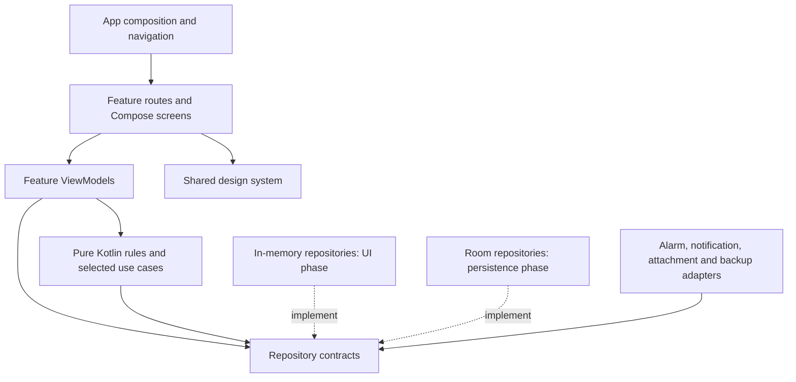

# TickTick personal app architecture

Sound settings (2026-09-25): Settings has four independently persisted built-in Android tone choices: task completion, notification, habit completion and reminder popup. AppSounds reuses Room UI preferences and owns bounded in-app playback; committed mutation callbacks drive completion audio without replay on database observation. The old habit ringtone entry now shares Notification. Background notifications select a sound-specific notification or popup channel so a popup reminder has one audio source. No schema/dependency/media-permission changes. See the [backend plan](BACKEND_IMPLEMENTATION_PLAN.md) for exact defaults, paths and build-only evidence; device audio remains unverified.

Reminder popup correction (2026-09-25): a non-exported translucent ReminderPopupActivity in its own task reuses the task ReminderHost and habit check-in screen for fresh background alerts. User-granted display-over-other-apps access enables the supported background-activity exception; lock-screen delivery uses a permitted notification full-screen intent. Channels, Do Not Disturb and habit Auto pop-up remain authoritative, and notification fallback survives popup denial. MainActivity reminder presentation requires RESUMED state. No service, dependency or schema changes are needed. See the [backend plan](BACKEND_IMPLEMENTATION_PLAN.md) for source paths, permission setup, build evidence and pending device acceptance.

Backend B5 update (2026-09-25): schema 5 adds versioned UI preference and editor-draft records through `RoomUiStateRepository`, with explicit migration 4-to-5. Startup gates on both repository loads. Presentation/completed settings are per task destination; Calendar mode/date/completed settings are independent. Application-owned ordered draft writes retain task/habit edits across editor disposal, with failure/retry feedback and session/version tombstones. Task/habit saves clear their acknowledged draft atomically; planning task actions commit their review checkpoint in the same transaction. Resolved NLP predictions, manual schedules and interrupted attachment-import markers are retained without storing media bytes. Task/date/zone queries refresh on resume and at midnight; Habit home and Calendar consume the shared date. The [backend plan](BACKEND_IMPLEMENTATION_PLAN.md) records policies, changed paths and build-only evidence. B1-B5 are implemented with runtime acceptance pending; attachment ownership/recovery is next in B6. Earlier references to session-only preferences/drafts are historical.

Backend B4 update (2026-09-24): `RoomTaskRepository` is the shared transaction coordinator for tasks, its `HabitRepository` facade and durable reminders. Schema 4 adds habits, effective schedule revisions, canonical dated quantities, ordered sections and habit settings, with migration 3-to-4. `HabitRules` derives completion, weekly targets, finite goals and streaks from those quantities and historical configurations; no writable completed-date mirror remains. Habits, Tasks List and Calendar observe the same committed snapshot. The existing reminder outbox/platform pipeline now supports multiple habit times, check-in/dismiss actions, selected sound, conditional foreground log opening and silent missed summaries. Production databases start without sample habits. See the [backend plan](BACKEND_IMPLEMENTATION_PLAN.md) for precise policies, changed paths and build evidence. B1-B4 are implemented with runtime acceptance pending; preferences/drafts beyond habit settings remain B5. This supersedes historical session-only habit and deferred reminder/streak descriptions below.

Backend B1 update (2026-09-18): `AppContainer` now uses `RoomTaskRepository` for tasks in both build variants. Schema 1 stores tasks, organization, child records and snooze; repository writes are suspending and revision-checked, and UI startup/save failures are explicit. Habits, holidays and Focus retain their prior storage behavior. Fresh task databases initialize only Inbox. See the [backend plan](BACKEND_IMPLEMENTATION_PLAN.md) for implementation details and build-only verification; historical session-only task descriptions below are superseded.

Backend planning update (2026-09-16): read the [backend implementation plan](BACKEND_IMPLEMENTATION_PLAN.md) first for the current backend checkpoint, delivery order and verification status. The user has requested backend planning now, ahead of unfinished UI acceptance; the historical UI-first gates below do not block that planning. No backend implementation is completed by this documentation update.

Drawer Add increment (2026-09-09): `feature/organization` provides shared full-screen form/color components plus a Normal/Advanced filter editor. TaskRepository creates colored lists with an initial view, explicit tags and SavedTaskFilter records; TaskSnapshot merges explicit and task-derived tags. Pure FilterRule matching supports live result queries/counts through new tag/saved-filter TaskFilter variants. Creation uses existing session storage and SavedStateHandle-based view navigation; durable management remains deferred. See [reference notes](references/DRAWER_ADD_REFERENCES.md).

List habits / daily alert toggle follow-up (2026-09-08): the Tasks shell passes the existing HabitSnapshot into List layout. Scheduled habit occurrences are derived separately from TaskGroup and use the existing check-in screen with a return-to-list callback. Kanban remains task-only. `TasksViewModel` exposes `dailyAlertsEnabled`, derived from the enabled date in SavedStateHandle and the injected clock. The daily switch is an animated, accessible UI preference; notification delivery integration and durable storage remain deferred. This supersedes earlier task-only placement statements for home List layout. See [reference notes](references/TASK_VIEW_REFERENCES.md).

Task view increment (2026-09-08): `TasksViewModel` combines shared records with per-destination `TaskPresentation` preferences held in SavedStateHandle. Pure sorting/grouping helpers produce shared List/Kanban groups without duplicating task records. Task timestamps are assigned by the session repository with the injected clock, and unchanged saves preserve modification time. The reference popup and background/group-sort sheets use the shared design system; a bounded local-image decoder is shared with attachments. Task Manage Section, View Options and Share are excluded by the user's correction; earlier target references to task sections below are superseded. See [task-view notes](references/TASK_VIEW_REFERENCES.md). Debug APK assembly passed; runtime/visual checks remain pending.

Calendar views increment (2026-09-08): the second tab now provides List, Day, Week and Month views in `feature/calendar`, deriving per-date task/habit/holiday occurrences from the shared repositories. A read-only in-memory `HolidayRepository` joins the container; debug seeds clearly labeled sample holidays (no region assumed) and the legend shows the source label. Selected date/view live in saveable tab state; repeat rules are not expanded into occurrences. Build-only validation. See the tenth increment below.

Tasks/Calendar correction (2026-09-08): `TasksScreen` is task-only again. The root passes `HabitSnapshot` to `CalendarContent`, which derives scheduled active habits for its own selected date alongside tasks. Habit selection carries the calendar occurrence date into check-in. The user's explicit placement correction supersedes the earlier Today/Upcoming habit integration described below.

Habit check-in increment (2026-09-08): `HabitCheckInScreen` receives a habit ID-resolved record and local date. Home, library and task occurrence routes open it before the editor. `HabitSnapshot.progress` and completed dates update atomically through `HabitRepository.setProgress`; date eligibility uses the injected clock. Delete removes the record plus both history maps. Sharing uses Android's chooser; illustration rendering is local Compose Canvas. Basic check-in/undo is implemented, while celebration/streak/goal lifecycle and production storage/reminders remain deferred. Build-only validation passed.

Habit management increment (2026-09-08): `HabitSnapshot` also owns `HabitSettings`; records have an archive flag. Repository mutations preserve check-in history while archiving/restoring. `habitsFor(date)` shares schedule/archive filtering and check-in sorting between Habits and the optional Today/Upcoming habit occurrences. Full-screen library/settings/sections pages replace provisional dialogs. Ringtone selection stores an Android notification-sound URI; actual sound and launcher-badge delivery remain deferred. See [reference notes](references/HABIT_REFERENCES.md).

Latest increment (2026-09-07): Habits home and custom creation now use `feature/habits`, the plain Kotlin `Habit`/`HabitSnapshot` models, and an application-scoped `HabitRepository` with an in-memory implementation. The editor stages a saveable draft and child picker choices, while home observes shared records and sections. The corrected screenshot mappings, interaction scope and build-only validation are in [Habits references](references/HABIT_REFERENCES.md). Check-in execution, durable storage and alarm delivery remain subsequent work; earlier placeholder descriptions below are historical.

Status: UI implementation in progress; source reviewed 2026-09-06. Section 2 records implemented increments. Later sections describe the target architecture and do not by themselves indicate implemented features.

Product source: [Personal Task & Habit App — Project Details](personal_task_habit_app_project_details.md).
Delivery checklist: [UI implementation plan](UI_IMPLEMENTATION_PLAN.md).

## 1. Decision

Build the complete interactive Android UI first, using production-shaped state, repository contracts, and a shared in-memory implementation. Then implement Room and Android integrations behind those contracts. The same screen composables and ViewModels serve both stages.

Use a feature-organized, single-module application with Compose, MVVM, and unidirectional data flow. Keep business rules in plain Kotlin and use cases where an operation coordinates multiple concerns. Do not add a generic MVI framework, a base ViewModel, or a use case for every repository method.

The first deliverable is an installable UI demo in which navigation, task editing, planning, habit check-ins, and reminder interactions work coherently during the session. It is not the production persistence or alarm-reliability milestone. The UI phase may implement small pure Kotlin rules needed for convincing interactions; it does not wait for database or background-service work.

## 2. Existing project

Initial inspection on 2026-09-05 found one `:app` module, package/application ID `com.niranjan.ticktick`, Compose enabled, and a generated `MainActivity` displaying `Hello Android!`. At that point the theme used the generated purple palette with dynamic color, and no repositories, feature screens, database, alarm components, or reference screenshots were present. The increments below supersede that initial inventory. The 2026-09-06 review found no existing graphify graph and inspected source directly.

Initial configuration: min SDK 24, target SDK 36, compile SDK 36.1, AGP 9.2.1, Kotlin Compose plugin 2.2.10, Compose BOM 2026.02.01. Compile SDK is now 37.0, as recorded below and confirmed in `app/build.gradle.kts`; min/target SDK remain 24/36. Preserve the namespace and existing toolchain.

Documentation belongs in root `docs/`. During the first UI implementation, the supplied brief was moved here because Markdown inside `app/src/main/res/docs` prevents Android resource compilation.

### First implementation increment

The Today and drawer references are now stored in [references](references/README.md). The first implementation includes the shared task list, drawer, task completion, list switching, basic create/edit/search/list dialogs, and the four-tab shell. Calendar and Focus have basic local surfaces; Habits currently has only its empty shell. Detailed editor, settings, and other screen designs await their own references.

This increment uses an application-scoped in-memory repository. Sample records are isolated under `src/debug`; release has an empty Inbox seed, and still uses session-only storage until Room is connected. The container/repository implementation must be replaced before the production gate. Only one full-screen destination is currently developed; Navigation 3 is deferred until full-screen feature flows are added. Reference notes distinguish implementation from the full planned architecture.

Validation for this increment is compilation and debug APK assembly only, per the user's instruction. No emulator or end-to-end tests are run, and pixel parity is not certified from a successful build.

### Second implementation increment — 2026-09-06

Quick Add and full-screen Task Detail now share `TaskEditorViewModel`, with local date parsing, expression suppression, description, priorities, tags, checklist, note mode, and attachment metadata. The simple task-entry dialog has been removed. New task drafts save explicitly; valid existing task edits save after a debounce and flush on Back. A single editor window retains the draft while switching sheet/full-screen presentation. See [editor reference notes](references/EDITOR_REFERENCES.md) for screenshot mappings, the current functional scope, and the basic picker/voice behavior that remains provisional. Navigation 3 and production persistence are still pending. Verification remains compilation and debug assembly only.

### Third implementation increment — 2026-09-06

Date/Duration, time, reminder, and repeat configuration now use shared screenshot-based components in `feature/taskeditor/schedule`. `TaskSchedule`, `TaskDuration`, `ReminderConfig`, and `RepeatRule` are plain Kotlin value types. The picker stages changes until Apply, then updates the editor and shared repository; cancelled child choices preserve the prior selection. Task-row due labels provide a direct entry point. See [schedule reference notes](references/SCHEDULE_REFERENCES.md) for implemented behavior and reference assumptions. Alarm delivery and recurrence execution remain deferred. Current compile SDK is 37.0; verification is debug compilation/assembly only.

### Fourth implementation increment — 2026-09-06

Priority and list selection now use reusable floating menus in `feature/taskeditor/EditorSelectionMenus.kt`, shared by Quick Add and Task Detail. Their values and single active panel remain owned by `TaskEditorViewModel`; the menus receive values/callbacks and do not create another draft or repository. Quick Add positions priority above its flag action and lists above the sheet. Task Detail reuses the rows below its header actions. Menus use the editor's existing dimmed window and preserve IME ownership.

The user clarified that the tag action inserts `#` into the title, while Quick Add's list action inserts `~` and opens the list menu. The basic comma-separated tag dialog has been removed. Inline tags use the existing parser/highlighting; reopening a task reconstructs title-derived tags separately from manual associations so a removed/renamed title tag does not survive as stale metadata. Tag chips focus the matching title label for editing; a separately stored label can be moved into the title for editing. List selection preserves the source text and updates the same draft/list ID used throughout the app. See [organization reference notes](references/ORGANIZATION_REFERENCES.md) for reference dimensions, interaction details, and limitations. Verification remains compilation and debug assembly only; Room, real reminders, and the remaining UI milestones are unchanged.

The 10:15 selected-list reference corrects the final selection state: Quick Add replaces `~` with a highlighted icon/name token such as `~💼Work` and displays the icon/name in its toolbar. `EditorListTokens.kt` centralizes glyphs, token matching, highlight spans, and offset-preserving masking for date/tag parsing. List changes replace the existing token while preserving surrounding title text; `listId` remains authoritative. Both editor presentations and saved-state reconstruction use the same selected list. This adds no repository or persistence layer.

### Fifth implementation increment — 2026-09-06

The screenshot-based attachment menu now opens above Task Detail's paperclip. `AttachmentMenu` reuses editor popup/row primitives; `AttachmentCards` renders shared image/file/audio cards in both editor presentations with open/delete actions. `TaskAttachment` gains optional byte-size metadata with backward-compatible saved-state reconstruction. `TaskEditorViewModel` owns the import job and loading state so asynchronous metadata loading survives ordinary configuration changes and cannot be silently omitted by Save.

`AttachmentActions` centralizes document-picker and external-camera activity results. Camera output is exposed through the narrowly scoped `platform/attachments/AttachmentFileProvider`; selected URI grants are retained where providers permit. Records currently imports existing audio, and Scan Documents offers a document photo or existing PDF/image. In-app recording, automatic scanning, managed-file cleanup, Room-backed attachment ownership, and durable recovery remain later work. Added-attachment card layout is inferred with the user's permission because the reference app blocks it behind premium. See [attachment reference notes](references/ATTACHMENT_REFERENCES.md) for behavior, geometry, storage limits, and compile-only verification. The screenshot's collapsed Task Detail presentation is not part of this menu increment.

### Sixth implementation increment — 2026-09-06

Plan Your Day now opens from the Today lightbulb and Tasks overflow. `feature/planning/PlanYourDayViewModel` maintains a stable review of active non-note IDs and observes live task/list data from the same application-scoped repository. `PlanYourDayScreen` presents a full-screen horizontal pager with Done, Today, Later, Won't Do and confirmed Delete. Swiping browses only; actions target the settled card and advance after a successful update. The user's verbal follow-up replaces the provisional schedule-picker behavior: Today swaps the footer for Morning 10 AM / Afternoon 1 PM / Evening 5 PM / Night 9 PM, and Later swaps it for Tomorrow / 3 days later / Next week (7 days). ViewModel-owned menu state is bound to the displayed task ID; Back or changing cards cancels it. Choosing an option validates the shared `TaskSchedule` and saves through the repository, preserving reminder/repeat configuration and duration length. Planning remains independent of `TaskEditorViewModel`.

`Task.declined` distinguishes Won't Do from completion, while `Task.isActive` centralizes filtering/count behavior. Repository completion and decline operations clear the opposite state. Task rows and Task Detail allow restoration; editor draft serialization preserves declined. Reviews resume within the same day/configuration lifetime, and reset on process restart along with session-only data. Recurrence advancement remains deferred, so Done/Won't Do currently operate on the task record rather than an occurrence. See [planning reference notes](references/PLANNING_REFERENCES.md) for selection/order/progress rules and provisional states.

The user has deferred Templates, Quick Add Settings and Suggested Tasks. Template/settings entries are hidden while their earlier basic implementation remains dormant; the suggestions overlay was removed. Verification remains compilation/debug assembly only, without runtime or visual claims.

### Home date sections — 2026-09-06

The Home/Today destination now has Overdue, Today and Upcoming tabs styled with the existing selected pill. `HomeTaskSection` classifies dated tasks before, on or after the injected local date. `TasksViewModel` owns the selected section through `SavedStateHandle` and combines it with the shared repository and existing completion/sort settings; no second task collection is introduced. Home sections cover every list and sort by due date/time. Undated tasks remain available in Inbox/their list. Completed and declined tasks remain hidden unless Show Completed is enabled. Returning through the drawer's Today action selects Today; ordinary tab/configuration changes retain the selected section. Shared task-row editing, schedule actions and Plan Your Day mutations feed these queries automatically.

Verification: compilation and `:app:assembleDebug --console=plain` passed (6 seconds). Runtime and visual comparison remain unverified under the user's build-only instruction.

### Next increment recommendation — task reminder popup and snooze

Source review on 2026-09-06 confirms that `AppContainer` supplies one application-scoped `TaskRepository` and clock to Tasks, the shared editor, and Plan Your Day. `AppOverlays` currently handles the drawer notification shortcut with a basic "Scheduled tasks" dialog filtering active tasks with a due time. It is not a delivery queue or a reminder history screen. `ReminderConfig` stores offsets, Constant Reminder and a date-only base time; neither `Task` nor the editor currently stores a snooze deadline. Habits is still an empty shell in `TickTickApp`.

The initial recommendation was the remaining task reminder interaction slice of UI-3: an in-app reminder card, Close/Complete, all snooze choices including Custom and Change Date, and a snooze indicator in Task Detail. The seventh and eighth increments below now implement the supplied reminder/Snooze references; Task Detail's snooze presentation remains pending. See the current [reminder reference notes](references/REMINDER_REFERENCES.md).

Planned integration boundaries:

- Add `feature/reminders` with an app-scoped presentation ViewModel and reusable card/snooze controls. It observes shared task records by ID and owns the active overlay; it must not call `TaskEditorViewModel.beginExisting` to deliver an alert or replace an open draft. Host presentation above the editor/planning dialog windows while preserving their state.
- Keep task reminder delivery/dismissal/snooze state in an application-scoped in-memory contract shared with Task Detail. Separate the snooze instant from `TaskSchedule` and `ReminderConfig`: snoozing leaves the due date/time intact; Change Date stages the shared schedule controls and invalidates obsolete alert state only after Apply. Final types are introduced with implementation, not pre-created here.
- Use stable alert IDs and a queue so multiple deliveries and repeated actions cannot overwrite another alert or complete twice. Re-read task eligibility for actions and reconcile externally completed, declined, deleted or rescheduled tasks. Recurrence occurrence generation remains deferred; the first slice operates on current task records.
- Address editor concurrency as part of the slice. Today, `TaskEditorViewModel.save()` writes a complete `Task` reconstructed from its draft. A later save must not undo completion, snooze or a date change applied by a reminder while the editor is open. Use targeted repository mutations and explicit reconciliation of externally changed fields while retaining user-entered text and selection.
- Provide a clearly identified debug-only simulated delivery entry. This increment does not register Android alarms, issue background/lock-screen notifications, or implement a reminder-center redesign, habit alerts, Room, or actual Constant Reminder delivery. Those remain later work.

Reference capture, including premium-blocked screens, follows the user's screenshots or verbal description. No geometry is inferred for an uncaptured screen without that description. Verification remains compilation and debug APK assembly only; runtime interactions and visual parity remain unverified.

### Seventh reference increment — Snooze and Change Date, 2026-09-06

The supplied references cover Snooze options, Custom Snooze and Change Date; the fourth image repeats Plan Your Day. The fired reminder popup and snoozed Task Detail remain pending. The [reminder reference notes](references/REMINDER_REFERENCES.md) now distinguish the implemented portion from the broader recommendation above.

`feature/reminders/SnoozeViewModel` observes the same `TaskRepository` and injected clock as the other features, retaining only the target ID and small picker values in saved state. `TaskSnapshot.snoozedUntil` holds session deadlines by task ID, outside the editor's serialized task fields. `TaskRepository.snooze` updates this state without changing the due date/time. `changeSchedule` atomically applies schedule fields to the latest record and clears obsolete snooze state. Ordinary task content edits preserve snooze; schedule/status/note/deletion changes invalidate it.

`SnoozeHost` provides the captured two-row menu, custom wrapping hour/minute wheels, keyboard input and resolved-time label. Today Night means 21:00 today and is disabled when passed. Tomorrow preserves the original due time, falling back to the configured date-only reminder time. These named-time choices follow the user's clarification. Change Date invokes the existing `SchedulePicker` with a centered presentation, staged Clear, per-field clear actions and Cancel/OK; the existing editor sheet retains its default presentation.

The app host owns this ViewModel without depending on `TaskEditorViewModel`. A debug-only Preview Snooze action in the existing Scheduled tasks dialog exposes the screens and saved deadline. Release omits that preview entry. This does not implement a fired alert, delivery queue, reminder-center redesign or Task Detail snooze layout. The broader card/interruption work, including protection against stale editor field saves, awaits its references. Separate snooze storage already prevents ordinary editor task serialization from dropping a deadline.

Validation remains compilation/debug APK assembly only. No alarms, persistence, recurrence execution, runtime correctness or visual parity are claimed.

### Eighth reference increment — reminder card and session queue, 2026-09-06

The 18:40 reference supplies the reminder card. `ReminderCard` displays live priority, due date/time, list, title, description and checklist lines, with Snooze/Complete/Close controls. The user identified the circular header action as Focus and explicitly excluded it; the card omits that action. The browser content behind the reference is not part of the app.

`ReminderViewModel` and `ReminderHost` replace the earlier Snooze-only classes. The host is composed after editor/planning hosts and reuses one dialog for the reminder card and Snooze pages. Date editing retains the shared centered child schedule dialog. Back from Snooze returns to the card; Close/Back on the card dismiss only the current alert. Complete, successful Snooze and Change Date update the shared repository and advance the queue.

Queue entries carry a stable delivery ID, task ID and captured schedule/snooze identity. Task/list content is always observed live. Repeated pending deliveries for the same task are ignored. Repository changes reconcile completed, declined, deleted, note-converted, rescheduled and snoozed entries out of the queue. Mutating callbacks retain the ID of the rendered delivery and validate it against the current queue head, avoiding a repeated action against the next card. Queue membership and delayed previews survive ordinary configuration changes with the ViewModel and reset on process restart; no durable occurrence history is implied.

`TaskEditorViewModel` now reconciles externally changed schedule/status fields both when the repository emits and immediately before saving. External reminder schedule/completion changes take precedence for those fields while typed title, description, checklist/attachment edits and text selection remain in the draft. The editor closes an obsolete date picker when the underlying schedule changes. This closes the previously documented stale full-record save problem for reminder interruption. Snooze deadlines remain separately owned by `TaskSnapshot.snoozedUntil`.

Debug Scheduled tasks now offers Preview Reminder, Preview in 10 seconds, and Preview all reminders. The delayed option uses a ViewModel coroutine to make app-wide presentation reachable during editor/planning/tab use; it is not a system alarm. Release omits these entry controls. Actual Android alarm/notification delivery, recurrence execution, Constant Reminder re-alerts, durable persistence and Task Detail's snooze layout remain later work. Verification is compilation/debug assembly only; runtime interruption, keyboard restoration and visual parity are unverified.

### Ninth increment — Task Detail snooze status, 2026-09-07

The user approved a verbal reference: selecting a one-hour snooze at 18:00 produces a 19:00 deadline, displayed as "Snoozed until…" while retaining the original due date/time. The interval starts when Snooze is selected. No additional screenshot is required for this increment.

`TaskEditorHost` reads the current task's deadline from the already observed `TaskSnapshot.snoozedUntil` map and passes it into the full-screen editor. A blue Snooze icon and wrapping status line appear directly below the existing due-date row, using the same Today/Tomorrow/date/time formatter as Custom Snooze and the debug list. This read-only value stays outside the editor draft and task schedule. It updates an open or reopened Task Detail through the shared snapshot. Only existing active non-note tasks with a stored deadline show it; existing repository invalidation clears it after schedule/status/note/deletion changes. Content-only edits preserve it. The original date row retains its schedule-editing action.

Compilation and debug assembly passed on 2026-09-07 (`BUILD SUCCESSFUL in 1m 15s`, no Kotlin warnings). No runtime/device/unit/end-to-end or visual checks were run. Actual reminder delivery and durable storage remain deferred.

### Tenth increment — Calendar views, 2026-09-08

`feature/calendar` replaces the provisional `CalendarContent`. `CalendarScreen` owns the List/Day/Week/Month selector, Today/previous/next navigation, a category legend, and a Show/Hide Completed action bound to the shared `TasksViewModel` setting. Selected date and view are `rememberSaveable` values inside the tab's `SaveableStateProvider`, surviving tab switches and rotation. `CalendarData` derives per-date occurrences from the shared task, habit, and holiday snapshots: duration tasks span `startDate..endDate` (multi-day timed spans render start/end segments with all-day middles), `dueTime`-only tasks get a default one-hour block, date-only/all-day items and habit check-ins occupy the all-day area, and habits follow the existing `habitsFor` schedule/archive rules with checked-in rows hidden unless Show Completed. Overlapping timed blocks share width through greedy overlap-cluster columns; weeks start on Sunday to match the schedule picker.

Holidays come from the new read-only `HolidayRepository` (`domain/model/Holiday.kt`, in-memory implementation, container wiring). The user skipped the holiday-source question, so the debug seed carries holidays explicitly labeled "(Sample)" under the "Sample holidays" source label rendered in the legend; release seeds an empty, unconfigured source. No real-world holiday dates are claimed and no region is assumed. Task blocks open the shared editor, habit blocks open check-in with the tapped occurrence date, and holiday rows are display-only. Recurrence execution remains deferred, so repeating tasks appear only on their current due date. Validation is compilation and debug APK assembly only (`BUILD SUCCESSFUL in 24s`); runtime and visual checks remain unverified. See [calendar reference notes](references/CALENDAR_REFERENCES.md).

## 3. Boundaries and dependencies



Arrows describe source dependencies, not all runtime calls. Composition wires concrete adapters to contracts. Feature code imports domain models and repository interfaces, never Room entities, DAOs, AlarmManager, or another feature's ViewModel. Android integration contracts are introduced when their first caller needs them.

Production UI uses one main activity. Add a narrowly scoped reminder activity only if the supported full-screen notification path requires it. That activity reuses the reminder presentation and domain actions.

```text
app/src/main/java/com/niranjan/ticktick/
  MainActivity.kt
  app/
    TickTickApp.kt                  # composition and app shell
    AppContainer.kt                # constructor wiring
    navigation/                    # routes, stacks, intent entry mapping
  core/
    designsystem/                  # theme, tokens, primitive components
    time/                          # injected clock and zone provider
  domain/
    model/                         # platform-independent product types
    repository/                    # feature-facing contracts
    nlp/                           # parser, spans and interpretation
    recurrence/                    # recurrence calculation
    habits/                        # eligibility and streak calculation
    usecase/                       # completion, snooze, other coordinated actions
  feature/
    tasks/                         # Inbox, Today, custom lists, task rows
    taskeditor/                    # Quick Add and full-screen Task Detail
    planning/                      # Plan Your Day; Suggested Tasks deferred
    search/
    lists/                         # list management
    tags/
    habits/                        # list, creation, check-in and statistics
    reminders/                     # reminder card and snooze UI
    calendar/                      # List/Day/Week/Month calendar views
    focus/                         # minimal session screen
    settings/
  data/                            # introduced during persistence phase
    local/                         # Room database, DAOs, entities, migrations
    mapper/
    repository/
  platform/                        # introduced during integration phase
    reminders/                     # scheduler, receivers, notifications, capabilities
    attachments/
    backup/

app/src/debug/java/com/niranjan/ticktick/demo/
  DemoAppContainer.kt
  InMemoryStore.kt
  repository/
  fixtures/
  catalog/                         # component gallery and scenario controls
```

Create packages as they acquire code. Existing `ui/theme` moves into the design system when the theme is replaced. Subdivide a feature only when needed; do not create empty architecture layers.

Keep `:app` as the only Gradle module initially. The package boundaries permit extraction of `:core:model`, `:core:designsystem`, `:data:local`, or `:platform:reminders` if build time or independent ownership later warrants it. No per-screen modules in V1.

## 4. Technology choices

| Concern | Decision |
| --- | --- |
| Rendering | Jetpack Compose; Material 3 for accessible foundations; custom components for reference fidelity |
| State | Feature ViewModels, immutable `UiState`, `StateFlow`, coroutines |
| Navigation | Navigation 3 with serializable typed keys, saved back stacks, and entry-scoped ViewModels |
| Dependency injection | Constructor injection with a small application container and explicit ViewModel factories |
| Dates | `java.time`, injected clock and zone; enable core library desugaring for min SDK 24 |
| UI development data | App-scoped in-memory store with deterministic fixtures and observable repositories |
| Durable data, later | Room, including product settings, drafts where necessary, and reminder state |
| System reminders, later | AlarmManager and notification/receiver adapters |
| Maintenance, later | WorkManager for reconciliation/backup maintenance, never as an exact reminder clock |
| Backup, later | Versioned JSON plus a separate policy for attachment files |

Compose state/event flow and lifecycle-aware state collection follow [Android architecture guidance](https://developer.android.com/topic/architecture/recommendations). Navigation 3 has stable releases; select a stable release compatible with the existing toolchain when scaffolding, rather than copying beta dependencies from documentation examples. See [Navigation 3 releases](https://developer.android.com/jetpack/androidx/releases/navigation3). Desugaring must cover the date APIs used on API 24–25: [Android API desugaring](https://developer.android.com/studio/write/java8-support#library-desugaring).

## 5. Screen contract and state ownership

Each substantial feature exposes a route, a screen, a ViewModel, a UI state, and named actions. For example: `TasksRoute`, `TasksScreen`, `TasksViewModel`, `TasksUiState`, `TasksAction`. Split files for readability, not to satisfy a template.

The route obtains the ViewModel, collects state using `collectAsStateWithLifecycle`, and connects navigation. The screen accepts state and callbacks, renders content, and can run in previews with no application container. Reusable controls use ordinary hoisted state, not their own ViewModels.

| State | Owner | Lifetime |
| --- | --- | --- |
| Task/habit/list records | Repository; Room in production | Across screens; durable only after Room integration |
| Selected tab and each tab's stack | App navigation state | Saved navigation state |
| Query, selected day, task selection | Feature ViewModel | Navigation entry; save small reconstruction values |
| New task draft and NLP overrides | Editor session ViewModel | Entire sheet/full-screen editor flow |
| Text selection, scroll position | Local saveable UI state | UI restoration where supported |
| Animation and pressed state | Local Compose state | Current composition |
| Date-picker temporary selection | Editor child state | Until Apply or Cancel |
| Permission/scheduler capability | Platform adapter, fixture in demo | Refresh when app resumes |

Do not serialize the repository, bitmap data, or unbounded lists into saved state. Use IDs and small reconstruction values. Saved state supports system recreation but is not durable storage; arbitrary unfinished content requires a draft store in the persistence phase. See [saving Compose state](https://developer.android.com/develop/ui/compose/state-saving).

Represent save failures and pending results in state, with explicit retry/acknowledgement. Do not use a fire-and-forget event channel for a save result whose loss would leave the editor open or discard work. Pure navigation initiated by a tap can be handled by the route. A save-dependent close occurs once after success, with an acknowledged operation ID.

## 6. Navigation and editing

The root has Tasks, Calendar, Focus, and Habits. Preserve each tab's position and stack. The drawer selects the Tasks filter (`Today`, `Inbox`, list ID, or tag ID) and links to Search, reminder center, Settings, and list management. Counts derive from the same repository queries as task lists.

Routes carry IDs and small parameters: `TaskDetail(taskId)`, `NewTask(editorSessionId)`, `HabitEditor(habitId?)`, `HabitCheckIn(habitId, date)`, `SuggestedTasks`, `PlanYourDay`, `Settings(section)`. Never pass complete entity graphs. Validate notification entry IDs and show a useful missing/deleted record state.

Quick Add is a sheet over the current task list. Promoting it to full screen changes presentation within the same editor session. Use one parent-scoped editor ViewModel keyed by session ID and render shared `TaskEditorContent` in either container. The session has explicit create/edit modes. Promotion does not insert a task, recreate the draft, or open an independently initialized editor.

New tasks commit only on Send/Save. Dirty dismissal offers Keep Editing or Discard. Existing task edits save valid changes after field commit or a short debounce, through a serialized update path. Back flushes pending changes before leaving; failure keeps the draft and exposes Retry. A cancelled nested picker never changes committed editor values. Disable duplicate submission while a save is pending.

The editor owns a sealed child-overlay state: date/duration, time, reminder, repeat, priority, tags, list, attachment, or more menu. Child sheets replace the active sheet content while preserving their parent state; a time dialog may sit above the date sheet. Avoid unrelated booleans allowing multiple conflicting sheets. Back dismisses keyboard/top child UI before closing the editor or popping the screen.

Reminder presentation is app-scoped so it can appear over any tab. Preserve an open draft and keyboard intent when a reminder interrupts. Queue simultaneous reminder occurrences by stable ID; never overwrite one with another.

## 7. UI-first data contracts

Use an application-scoped `InMemoryStore` behind separate task, list, tag, habit, settings, and reminder repository interfaces. All screens observe the same records. Mutations update immutable snapshots atomically and emit flows; a ViewModel must never mutate repository collections directly.

Illustrative contracts, finalized with their first feature:

```kotlin
interface TaskRepository {
    fun observeTasks(query: TaskQuery): Flow<List<Task>>
    fun observeTask(id: TaskId): Flow<Task?>
    suspend fun create(draft: TaskDraft): MutationResult<TaskId>
    suspend fun update(id: TaskId, changes: TaskChanges): MutationResult<Unit>
    suspend fun complete(id: TaskId, occurrenceId: OccurrenceId?): MutationResult<Unit>
    suspend fun delete(id: TaskId): MutationResult<Unit>
}
```

`MutationResult` distinguishes success, validation failure, missing/conflicting records, and storage failure. Do not expose Room types. Atomic operations that affect task occurrence, checklist, reminders, or history belong inside a repository transaction boundary; use cases coordinate policy and request reconciliation after commit.

Demo data is seeded once, uses stable IDs and a fixed clock, and supports Reset and scenario selection in a debug-only catalog. Include empty, populated, overdue, checklist, recurring, snoozed, long-text, missing-attachment, and failure scenarios. A failure fixture exercises the actual save/error presentation without pretending a system operation succeeded.

Until persistence is connected, process restart resets demo data. Configuration changes must preserve the active session. Debug fixtures and simulated device capabilities are excluded from the production binding; the release graph cannot silently fall back to demo repositories.

## 8. Product models to settle before screen code

| Model | Required distinctions |
| --- | --- |
| Task | Stable ID, title, description, task/note kind, list ID, section ID, priority, tags, status, due specification, duration, revision |
| Checklist item | Parent task ID, stable item ID, text, checked state, explicit order; no nested tasks |
| Due specification | None, date only, or date and time with a zone policy; duration start/end are separate |
| Recurrence | Due-date/completion basis for interval rules; explicit dates as a separate rule; interval, unit, weekdays, optional end condition |
| Occurrence | Stable occurrence identity for completion and reminder actions; distinct from recurring task identity |
| Reminder | Owner and occurrence IDs, trigger rule, constant-reminder preference, snoozed-until instant, dismissed/delivered state, schedule revision |
| List and tag | Stable ID, name, color token; list view preference and section/order metadata |
| Attachment | ID, owner, type, display name, local URI/path, MIME type, size, created time, availability |
| Habit | Name, icon/letter, quote, start date, section, frequency, amount/unit, goal days, reminders, auto-pop-up preference |
| Habit check-in | Habit ID, local date, quantity and timestamp; statistics derived from history and schedule |
| Settings | Typed appearance, date/time, notification, tab and other supported preferences |

Display labels such as `Tomorrow` and `High Priority` are derived strings, never database values. Date-only tasks must not become midnight timestamp tasks. Proposed default: task times and habit reminders follow the device's local wall clock; snoozes are absolute instants. Store that policy explicitly and recalculate future alarms when the zone changes.

Inject clock/zone into parsing, Today queries, recurrence, and streak calculations. Refresh date-sensitive UI at local midnight and on resume. Month-end recurrence clamps to the last valid date while retaining the original anchor; DST gaps shift to the next valid local time and overlaps use a defined offset. These are proposed rules requiring focused tests, not claims about TickTick's undocumented behavior.

Habit streaks count scheduled opportunities: selected weekdays and interval dates do not break on unscheduled days; weekly targets count consecutive qualifying weeks. The current incomplete week remains pending until its boundary. Store history, derive current/best streak and total check-ins, and make units clear in the stats UI.

## 9. NLP and reusable controls

Parsing returns interpretation and text spans without modifying title text. Keep manually selected date/time, current parsed result, and a suppressed expression fingerprint distinct. Manual selection takes precedence. Tapping an NLP chip suppresses that expression and removes its date/time interpretation; it never opens a picker. Unrelated title changes do not immediately reapply the dismissed expression; changing the recognized date/time expression makes it eligible again. Removing a token removes its derived value, without clearing a manual selection.

Implement the brief's English date/time expressions first, including optional `at`, spaced AM/PM, weekdays, and live `#tag`/`~list` behavior. Trigger `~` selection once per active token, handle Cancel, and offer create-tag when needed. Preserve IME composition, selection, cursor, and source text when highlighting; speech input later feeds the same parser.

Share `TaskRow`, `ChecklistRow`, `PriorityMenu`, `TagPicker`, `ListPicker`, `DateTimeEditor`, `TimePicker`, `ReminderEditor`, `RepeatEditor`, `AttachmentPicker`, `ReminderCard`, and `SnoozeSheet`. Presentation is reused across Quick Add, Task Detail, Today, and reminder screens; owner-specific values are passed in.

The design system holds semantic colors, type styles, spacing, radii, elevation, touch targets, and icon sizing. Use the brief's light blue-gray background, rounded white cards, blue accent, and system typography as provisional tokens. Disable dynamic color for the reference theme. Exact measurements, illustrations, and transitions remain unverified until screenshots are supplied. Accessibility semantics, font scaling, insets, and keyboard behavior are required from the first component.

## 10. Persistence and Android integrations after the UI gate

Room becomes the production source of truth. Tables cover the brief's entities plus task sections, occurrence/history records, and scheduling reconciliation metadata where required. Enforce foreign keys, checklist ordering, unique check-in keys, query indexes, and transactional aggregate writes. Store attachments as managed files with metadata in Room. Request persisted URI access where available, otherwise copy into app-private storage; model missing files explicitly.

Task completion, snooze, and rescheduling update durable desired state before touching AlarmManager. Give each scheduled occurrence a stable identity and revision. Receivers re-read state and ignore cancelled, completed, duplicate, or stale-revision deliveries. Reconcile after mutations, app start, boot, time/zone changes, and permission changes. A durable reconciliation marker closes the process-death gap between database commit and alarm registration; duplicate reconciliation must be harmless.

Close dismisses the current alert without completing the task and stops its constant re-alert cycle. Snooze overrides the pending alert instant without changing due time. Change Date updates the task schedule and invalidates obsolete snooze/alarms. Completing a recurring occurrence advances exactly once. A missed reminder is recorded as overdue; recovery should consolidate missed alerts rather than flooding the user. Constant reminders remain subject to platform rate limits.

Exact-alarm access can be absent or revoked; query capability and surface actionable degraded states. WorkManager cannot provide an exact reminder deadline. See [Android alarm scheduling](https://developer.android.com/develop/background-work/services/alarms).

While the app is foreground, render the reference reminder card. In the background, use an actionable high-importance notification, subject to user channel settings. Lock-screen presentation follows system privacy settings. Full-screen intents are restricted and are not guaranteed for a general task app; only add the path after verifying eligibility and device capability. Habit auto-pop-up follows the same policy. See [time-sensitive notifications](https://developer.android.com/develop/ui/views/notifications/time-sensitive) and [Android full-screen intent restrictions](https://developer.android.com/about/versions/14/behavior-changes-14#secure-fsi).

Force-stop is distinct from process death or removing the app from recents. Persistent data survives, but reminder execution cannot be promised while the app is force-stopped; reconcile on the next allowed launch. Android 15 cancels pending intents when force-stopping: [stopped-state behavior](https://developer.android.com/about/versions/15/behavior-changes-all#stopped-state).

Backup export uses a versioned schema and consistent database snapshot. Restore validates schema, references, and attachment availability before applying a transaction; V1 uses explicit replace-all confirmation and a pre-restore recovery snapshot. Cancel obsolete alarms and reconcile restored reminders after commit. JSON backup includes attachment metadata only; clearly disclose that media bytes need a later ZIP backup. Disable Android cloud backup in production to honor the offline/no-cloud requirement; device transfer policy should be configured deliberately.

## Recurrence backend update — 2026-09-21

B3 adds schema 3 recurrence state/history and shared date generation. Complete/Skip records one outcome and advances the current task atomically; stale revisions cannot act on its replacement. Calendar projects due-date/specific-date futures and completed history without creating editable database tasks. Completion-based rules expose only their current occurrence. Original anchors survive month/year clamping and reminder-only edits. See the [backend plan](BACKEND_IMPLEMENTATION_PLAN.md) for exact policies, evidence and pending runtime acceptance. Earlier deferred-recurrence statements are superseded.

## 11. Delivery gates

1. **Interactive UI complete:** every agreed V1 surface and transition works with shared demo data; all relevant empty/error/permission states can be inspected; keyboard, Back, rotation, and navigation pass the UI checklist. Screenshot fidelity is a separate pending check if references are absent.
2. **Persistence complete:** Room replaces demo bindings; data and drafts meet persistence expectations, attachment access is durable, backup/restore and migrations pass meaningful integration checks.
3. **Reminder reliability complete:** real device checks cover notification/exact-alarm permissions, process death, Doze, reboot, time/zone changes, duplicate deliveries, snooze, recurrence, and supported foreground/background/lock-screen presentation.
4. **V1 complete:** all completion criteria in the product brief pass, including habit recurrence/streak correctness and reference matching. A successful UI demo does not satisfy this gate.

The first work after the UI gate is the minimal durable task/reminder slice on a physical device. Validate the highest-risk platform behavior before expanding the remaining production integrations.

## Backend reminder implementation — 2026-09-18

B2 now implements schema 2 reminder deliveries, transactional reconciliation markers, persisted alert pause/resume, AlarmManager and notification adapters, shared actions and WorkManager recovery. This supersedes the earlier deferred-reminder status; recurring occurrence advancement remains B3. Constant reminders allow four follow-ups at 15-minute intervals; late recovery is silent and consolidated. See [backend plan](BACKEND_IMPLEMENTATION_PLAN.md) for exact behavior and evidence. Runtime/device acceptance remains pending under build-only verification.
