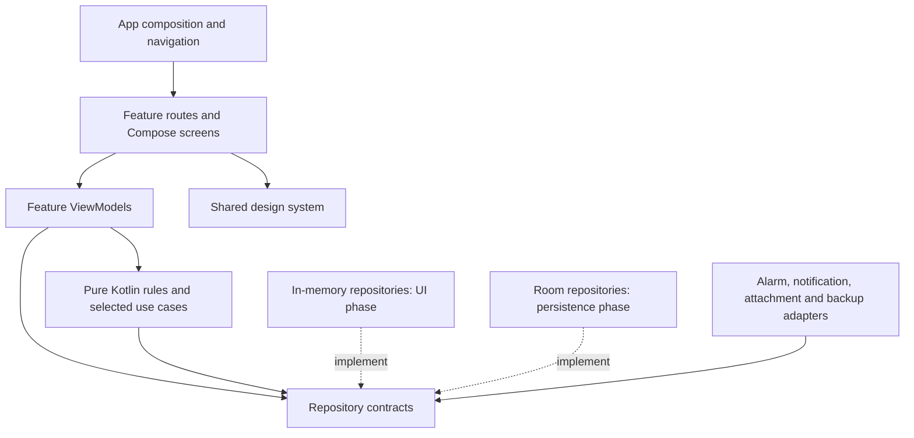

# TickTick personal app architecture

Status: proposed implementation architecture, 2026-09-05. This document specifies the design; it does not indicate that features are implemented.

Product source: [Personal Task & Habit App — Project Details](personal_task_habit_app_project_details.md).
Delivery checklist: [UI implementation plan](UI_IMPLEMENTATION_PLAN.md).

## 1. Decision

Build the complete interactive Android UI first, using production-shaped state, repository contracts, and a shared in-memory implementation. Then implement Room and Android integrations behind those contracts. The same screen composables and ViewModels serve both stages.

Use a feature-organized, single-module application with Compose, MVVM, and unidirectional data flow. Keep business rules in plain Kotlin and use cases where an operation coordinates multiple concerns. Do not add a generic MVI framework, a base ViewModel, or a use case for every repository method.

The first deliverable is an installable UI demo in which navigation, task editing, planning, habit check-ins, and reminder interactions work coherently during the session. It is not the production persistence or alarm-reliability milestone. The UI phase may implement small pure Kotlin rules needed for convincing interactions; it does not wait for database or background-service work.

## 2. Existing project

Inspection found one `:app` module, package/application ID `com.niranjan.ticktick`, Compose enabled, and a generated `MainActivity` displaying `Hello Android!`. The theme uses the generated purple palette and enables dynamic color. There are no repositories, feature screens, database, alarm components, or reference screenshots in the inspected project files. No existing graphify graph is present.

Current configuration: min SDK 24, target SDK 36, compile SDK 36.1, AGP 9.2.1, Kotlin Compose plugin 2.2.10, Compose BOM 2026.02.01. These are observed settings, not a verified dependency compatibility matrix. Preserve the namespace and baseline; validate the build when implementation begins.

Documentation belongs in root `docs/`. During the first UI implementation, the supplied brief was moved here because Markdown inside `app/src/main/res/docs` prevents Android resource compilation.

### First implementation increment

The Today and drawer references are now stored in [references](references/README.md). The first implementation includes the shared task list, drawer, task completion, list switching, basic create/edit/search/list dialogs, and the four-tab shell. Calendar and Focus have basic local surfaces; Habits currently has only its empty shell. Detailed editor, settings, and other screen designs await their own references.

This increment uses an application-scoped in-memory repository. Sample records are isolated under `src/debug`; release has an empty Inbox seed, and still uses session-only storage until Room is connected. The container/repository implementation must be replaced before the production gate. Only one full-screen destination is currently developed; Navigation 3 is deferred until full-screen feature flows are added. Reference notes distinguish implementation from the full planned architecture.

Validation for this increment is compilation and debug APK assembly only, per the user's instruction. No emulator or end-to-end tests are run, and pixel parity is not certified from a successful build.

## 3. Boundaries and dependencies



Arrows describe source dependencies, not all runtime calls. Composition wires concrete adapters to contracts. Feature code imports domain models and repository interfaces, never Room entities, DAOs, AlarmManager, or another feature's ViewModel. Android integration contracts are introduced when their first caller needs them.

Production UI uses one main activity. Add a narrowly scoped reminder activity only if the supported full-screen notification path requires it. That activity reuses the reminder presentation and domain actions.

```text
app/src/main/java/com/niranjan/ticktick/
  MainActivity.kt
  app/
    TickTickApp.kt                  # composition and app shell
    AppContainer.kt                # constructor wiring
    navigation/                    # routes, stacks, intent entry mapping
  core/
    designsystem/                  # theme, tokens, primitive components
    time/                          # injected clock and zone provider
  domain/
    model/                         # platform-independent product types
    repository/                    # feature-facing contracts
    nlp/                           # parser, spans and interpretation
    recurrence/                    # recurrence calculation
    habits/                        # eligibility and streak calculation
    usecase/                       # completion, snooze, other coordinated actions
  feature/
    tasks/                         # Inbox, Today, custom lists, task rows
    taskeditor/                    # Quick Add and full-screen Task Detail
    planning/                      # Suggested Tasks and Plan Your Day
    search/
    lists/                         # list management
    tags/
    habits/                        # list, creation, check-in and statistics
    reminders/                     # reminder card and snooze UI
    calendar/                      # minimal date/agenda screen
    focus/                         # minimal session screen
    settings/
  data/                            # introduced during persistence phase
    local/                         # Room database, DAOs, entities, migrations
    mapper/
    repository/
  platform/                        # introduced during integration phase
    reminders/                     # scheduler, receivers, notifications, capabilities
    attachments/
    backup/

app/src/debug/java/com/niranjan/ticktick/demo/
  DemoAppContainer.kt
  InMemoryStore.kt
  repository/
  fixtures/
  catalog/                         # component gallery and scenario controls
```

Create packages as they acquire code. Existing `ui/theme` moves into the design system when the theme is replaced. Subdivide a feature only when needed; do not create empty architecture layers.

Keep `:app` as the only Gradle module initially. The package boundaries permit extraction of `:core:model`, `:core:designsystem`, `:data:local`, or `:platform:reminders` if build time or independent ownership later warrants it. No per-screen modules in V1.

## 4. Technology choices

| Concern | Decision |
| --- | --- |
| Rendering | Jetpack Compose; Material 3 for accessible foundations; custom components for reference fidelity |
| State | Feature ViewModels, immutable `UiState`, `StateFlow`, coroutines |
| Navigation | Navigation 3 with serializable typed keys, saved back stacks, and entry-scoped ViewModels |
| Dependency injection | Constructor injection with a small application container and explicit ViewModel factories |
| Dates | `java.time`, injected clock and zone; enable core library desugaring for min SDK 24 |
| UI development data | App-scoped in-memory store with deterministic fixtures and observable repositories |
| Durable data, later | Room, including product settings, drafts where necessary, and reminder state |
| System reminders, later | AlarmManager and notification/receiver adapters |
| Maintenance, later | WorkManager for reconciliation/backup maintenance, never as an exact reminder clock |
| Backup, later | Versioned JSON plus a separate policy for attachment files |

Compose state/event flow and lifecycle-aware state collection follow [Android architecture guidance](https://developer.android.com/topic/architecture/recommendations). Navigation 3 has stable releases; select a stable release compatible with the existing toolchain when scaffolding, rather than copying beta dependencies from documentation examples. See [Navigation 3 releases](https://developer.android.com/jetpack/androidx/releases/navigation3). Desugaring must cover the date APIs used on API 24–25: [Android API desugaring](https://developer.android.com/studio/write/java8-support#library-desugaring).

## 5. Screen contract and state ownership

Each substantial feature exposes a route, a screen, a ViewModel, a UI state, and named actions. For example: `TasksRoute`, `TasksScreen`, `TasksViewModel`, `TasksUiState`, `TasksAction`. Split files for readability, not to satisfy a template.

The route obtains the ViewModel, collects state using `collectAsStateWithLifecycle`, and connects navigation. The screen accepts state and callbacks, renders content, and can run in previews with no application container. Reusable controls use ordinary hoisted state, not their own ViewModels.

| State | Owner | Lifetime |
| --- | --- | --- |
| Task/habit/list records | Repository; Room in production | Across screens; durable only after Room integration |
| Selected tab and each tab's stack | App navigation state | Saved navigation state |
| Query, selected day, task selection | Feature ViewModel | Navigation entry; save small reconstruction values |
| New task draft and NLP overrides | Editor session ViewModel | Entire sheet/full-screen editor flow |
| Text selection, scroll position | Local saveable UI state | UI restoration where supported |
| Animation and pressed state | Local Compose state | Current composition |
| Date-picker temporary selection | Editor child state | Until Apply or Cancel |
| Permission/scheduler capability | Platform adapter, fixture in demo | Refresh when app resumes |

Do not serialize the repository, bitmap data, or unbounded lists into saved state. Use IDs and small reconstruction values. Saved state supports system recreation but is not durable storage; arbitrary unfinished content requires a draft store in the persistence phase. See [saving Compose state](https://developer.android.com/develop/ui/compose/state-saving).

Represent save failures and pending results in state, with explicit retry/acknowledgement. Do not use a fire-and-forget event channel for a save result whose loss would leave the editor open or discard work. Pure navigation initiated by a tap can be handled by the route. A save-dependent close occurs once after success, with an acknowledged operation ID.

## 6. Navigation and editing

The root has Tasks, Calendar, Focus, and Habits. Preserve each tab's position and stack. The drawer selects the Tasks filter (`Today`, `Inbox`, list ID, or tag ID) and links to Search, reminder center, Settings, and list management. Counts derive from the same repository queries as task lists.

Routes carry IDs and small parameters: `TaskDetail(taskId)`, `NewTask(editorSessionId)`, `HabitEditor(habitId?)`, `HabitCheckIn(habitId, date)`, `SuggestedTasks`, `PlanYourDay`, `Settings(section)`. Never pass complete entity graphs. Validate notification entry IDs and show a useful missing/deleted record state.

Quick Add is a sheet over the current task list. Promoting it to full screen changes presentation within the same editor session. Use one parent-scoped editor ViewModel keyed by session ID and render shared `TaskEditorContent` in either container. The session has explicit create/edit modes. Promotion does not insert a task, recreate the draft, or open an independently initialized editor.

New tasks commit only on Send/Save. Dirty dismissal offers Keep Editing or Discard. Existing task edits save valid changes after field commit or a short debounce, through a serialized update path. Back flushes pending changes before leaving; failure keeps the draft and exposes Retry. A cancelled nested picker never changes committed editor values. Disable duplicate submission while a save is pending.

The editor owns a sealed child-overlay state: date/duration, time, reminder, repeat, priority, tags, list, attachment, or more menu. Child sheets replace the active sheet content while preserving their parent state; a time dialog may sit above the date sheet. Avoid unrelated booleans allowing multiple conflicting sheets. Back dismisses keyboard/top child UI before closing the editor or popping the screen.

Reminder presentation is app-scoped so it can appear over any tab. Preserve an open draft and keyboard intent when a reminder interrupts. Queue simultaneous reminder occurrences by stable ID; never overwrite one with another.

## 7. UI-first data contracts

Use an application-scoped `InMemoryStore` behind separate task, list, tag, habit, settings, and reminder repository interfaces. All screens observe the same records. Mutations update immutable snapshots atomically and emit flows; a ViewModel must never mutate repository collections directly.

Illustrative contracts, finalized with their first feature:

```kotlin
interface TaskRepository {
    fun observeTasks(query: TaskQuery): Flow<List<Task>>
    fun observeTask(id: TaskId): Flow<Task?>
    suspend fun create(draft: TaskDraft): MutationResult<TaskId>
    suspend fun update(id: TaskId, changes: TaskChanges): MutationResult<Unit>
    suspend fun complete(id: TaskId, occurrenceId: OccurrenceId?): MutationResult<Unit>
    suspend fun delete(id: TaskId): MutationResult<Unit>
}
```

`MutationResult` distinguishes success, validation failure, missing/conflicting records, and storage failure. Do not expose Room types. Atomic operations that affect task occurrence, checklist, reminders, or history belong inside a repository transaction boundary; use cases coordinate policy and request reconciliation after commit.

Demo data is seeded once, uses stable IDs and a fixed clock, and supports Reset and scenario selection in a debug-only catalog. Include empty, populated, overdue, checklist, recurring, snoozed, long-text, missing-attachment, and failure scenarios. A failure fixture exercises the actual save/error presentation without pretending a system operation succeeded.

Until persistence is connected, process restart resets demo data. Configuration changes must preserve the active session. Debug fixtures and simulated device capabilities are excluded from the production binding; the release graph cannot silently fall back to demo repositories.

## 8. Product models to settle before screen code

| Model | Required distinctions |
| --- | --- |
| Task | Stable ID, title, description, task/note kind, list ID, section ID, priority, tags, status, due specification, duration, revision |
| Checklist item | Parent task ID, stable item ID, text, checked state, explicit order; no nested tasks |
| Due specification | None, date only, or date and time with a zone policy; duration start/end are separate |
| Recurrence | Due-date/completion basis for interval rules; explicit dates as a separate rule; interval, unit, weekdays, optional end condition |
| Occurrence | Stable occurrence identity for completion and reminder actions; distinct from recurring task identity |
| Reminder | Owner and occurrence IDs, trigger rule, constant-reminder preference, snoozed-until instant, dismissed/delivered state, schedule revision |
| List and tag | Stable ID, name, color token; list view preference and section/order metadata |
| Attachment | ID, owner, type, display name, local URI/path, MIME type, size, created time, availability |
| Habit | Name, icon/letter, quote, start date, section, frequency, amount/unit, goal days, reminders, auto-pop-up preference |
| Habit check-in | Habit ID, local date, quantity and timestamp; statistics derived from history and schedule |
| Settings | Typed appearance, date/time, notification, tab and other supported preferences |

Display labels such as `Tomorrow` and `High Priority` are derived strings, never database values. Date-only tasks must not become midnight timestamp tasks. Proposed default: task times and habit reminders follow the device's local wall clock; snoozes are absolute instants. Store that policy explicitly and recalculate future alarms when the zone changes.

Inject clock/zone into parsing, Today queries, recurrence, and streak calculations. Refresh date-sensitive UI at local midnight and on resume. Month-end recurrence clamps to the last valid date while retaining the original anchor; DST gaps shift to the next valid local time and overlaps use a defined offset. These are proposed rules requiring focused tests, not claims about TickTick's undocumented behavior.

Habit streaks count scheduled opportunities: selected weekdays and interval dates do not break on unscheduled days; weekly targets count consecutive qualifying weeks. The current incomplete week remains pending until its boundary. Store history, derive current/best streak and total check-ins, and make units clear in the stats UI.

## 9. NLP and reusable controls

Parsing returns interpretation and text spans without modifying title text. Keep manually selected date/time, current parsed result, and a suppressed expression fingerprint distinct. Manual selection takes precedence. Tapping an NLP chip suppresses that expression and removes its date/time interpretation; it never opens a picker. Unrelated title changes do not immediately reapply the dismissed expression; changing the recognized date/time expression makes it eligible again. Removing a token removes its derived value, without clearing a manual selection.

Implement the brief's English date/time expressions first, including optional `at`, spaced AM/PM, weekdays, and live `#tag`/`~list` behavior. Trigger `~` selection once per active token, handle Cancel, and offer create-tag when needed. Preserve IME composition, selection, cursor, and source text when highlighting; speech input later feeds the same parser.

Share `TaskRow`, `ChecklistRow`, `PriorityMenu`, `TagPicker`, `ListPicker`, `DateTimeEditor`, `TimePicker`, `ReminderEditor`, `RepeatEditor`, `AttachmentPicker`, `ReminderCard`, and `SnoozeSheet`. Presentation is reused across Quick Add, Task Detail, Today, and reminder screens; owner-specific values are passed in.

The design system holds semantic colors, type styles, spacing, radii, elevation, touch targets, and icon sizing. Use the brief's light blue-gray background, rounded white cards, blue accent, and system typography as provisional tokens. Disable dynamic color for the reference theme. Exact measurements, illustrations, and transitions remain unverified until screenshots are supplied. Accessibility semantics, font scaling, insets, and keyboard behavior are required from the first component.

## 10. Persistence and Android integrations after the UI gate

Room becomes the production source of truth. Tables cover the brief's entities plus task sections, occurrence/history records, and scheduling reconciliation metadata where required. Enforce foreign keys, checklist ordering, unique check-in keys, query indexes, and transactional aggregate writes. Store attachments as managed files with metadata in Room. Request persisted URI access where available, otherwise copy into app-private storage; model missing files explicitly.

Task completion, snooze, and rescheduling update durable desired state before touching AlarmManager. Give each scheduled occurrence a stable identity and revision. Receivers re-read state and ignore cancelled, completed, duplicate, or stale-revision deliveries. Reconcile after mutations, app start, boot, time/zone changes, and permission changes. A durable reconciliation marker closes the process-death gap between database commit and alarm registration; duplicate reconciliation must be harmless.

Close dismisses the current alert without completing the task and stops its constant re-alert cycle. Snooze overrides the pending alert instant without changing due time. Change Date updates the task schedule and invalidates obsolete snooze/alarms. Completing a recurring occurrence advances exactly once. A missed reminder is recorded as overdue; recovery should consolidate missed alerts rather than flooding the user. Constant reminders remain subject to platform rate limits.

Exact-alarm access can be absent or revoked; query capability and surface actionable degraded states. WorkManager cannot provide an exact reminder deadline. See [Android alarm scheduling](https://developer.android.com/develop/background-work/services/alarms).

While the app is foreground, render the reference reminder card. In the background, use an actionable high-importance notification, subject to user channel settings. Lock-screen presentation follows system privacy settings. Full-screen intents are restricted and are not guaranteed for a general task app; only add the path after verifying eligibility and device capability. Habit auto-pop-up follows the same policy. See [time-sensitive notifications](https://developer.android.com/develop/ui/views/notifications/time-sensitive) and [Android full-screen intent restrictions](https://developer.android.com/about/versions/14/behavior-changes-14#secure-fsi).

Force-stop is distinct from process death or removing the app from recents. Persistent data survives, but reminder execution cannot be promised while the app is force-stopped; reconcile on the next allowed launch. Android 15 cancels pending intents when force-stopping: [stopped-state behavior](https://developer.android.com/about/versions/15/behavior-changes-all#stopped-state).

Backup export uses a versioned schema and consistent database snapshot. Restore validates schema, references, and attachment availability before applying a transaction; V1 uses explicit replace-all confirmation and a pre-restore recovery snapshot. Cancel obsolete alarms and reconcile restored reminders after commit. JSON backup includes attachment metadata only; clearly disclose that media bytes need a later ZIP backup. Disable Android cloud backup in production to honor the offline/no-cloud requirement; device transfer policy should be configured deliberately.

## 11. Delivery gates

1. **Interactive UI complete:** every agreed V1 surface and transition works with shared demo data; all relevant empty/error/permission states can be inspected; keyboard, Back, rotation, and navigation pass the UI checklist. Screenshot fidelity is a separate pending check if references are absent.
2. **Persistence complete:** Room replaces demo bindings; data and drafts meet persistence expectations, attachment access is durable, backup/restore and migrations pass meaningful integration checks.
3. **Reminder reliability complete:** real device checks cover notification/exact-alarm permissions, process death, Doze, reboot, time/zone changes, duplicate deliveries, snooze, recurrence, and supported foreground/background/lock-screen presentation.
4. **V1 complete:** all completion criteria in the product brief pass, including habit recurrence/streak correctness and reference matching. A successful UI demo does not satisfy this gate.

The first work after the UI gate is the minimal durable task/reminder slice on a physical device. Validate the highest-risk platform behavior before expanding the remaining production integrations.
